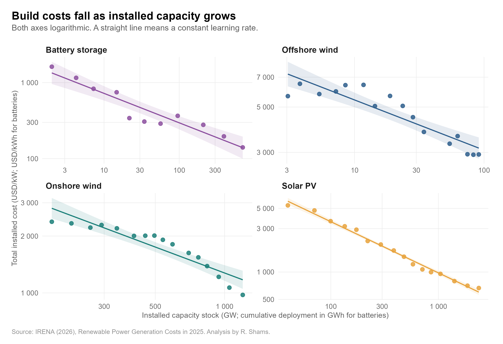
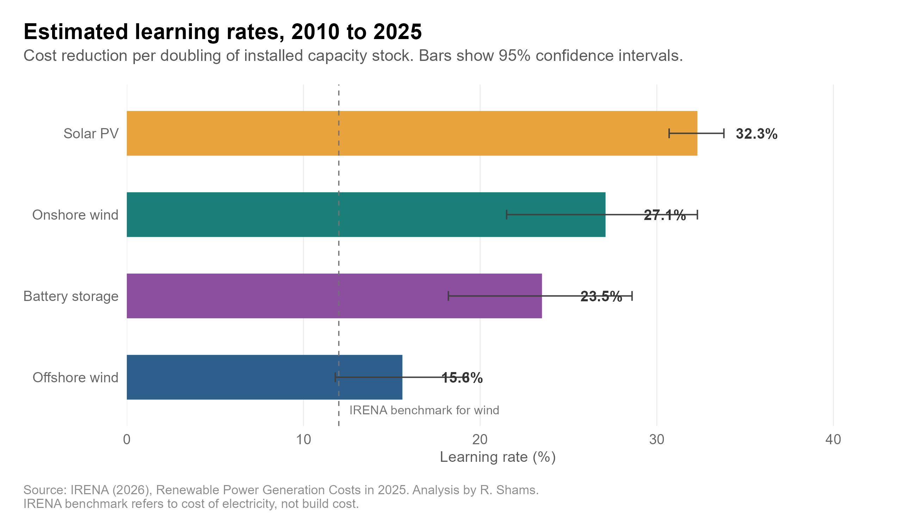
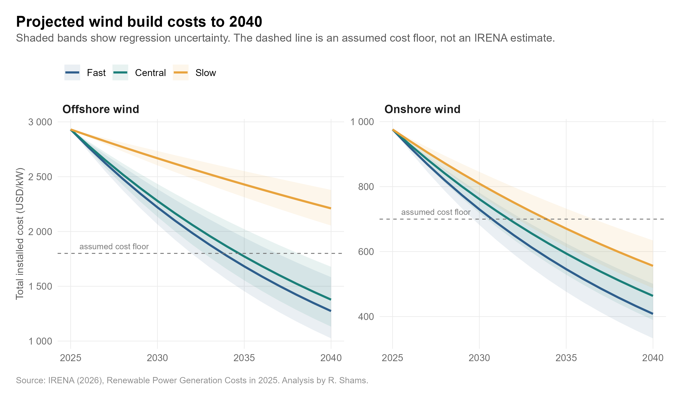
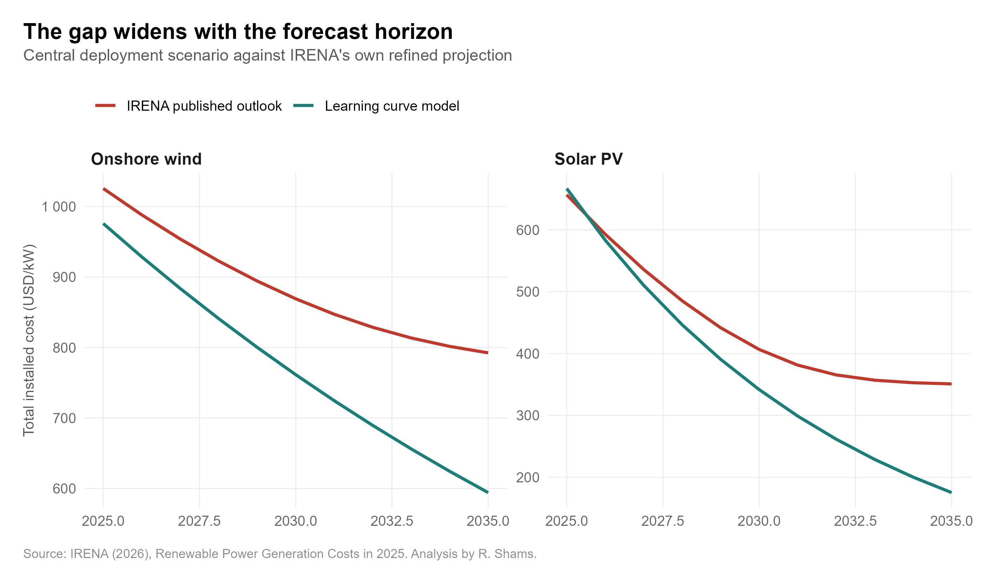

# Renewable Energy Learning Curves and Cost Forecasting

An R-based analysis of renewable energy technology learning rates, historical cost trends, and the limits of long-term cost forecasting using IRENA data.

## Research Question

**How much do clean energy build costs fall as global installed capacity grows, and can that relationship be used to forecast costs to 2040?**

## Project Overview

This project estimates historical experience curves for six renewable energy and storage technologies and explores how those relationships behave when projected forward to 2040.

The analysis has three stages:

1. Estimate historical technology learning rates.
2. Forecast costs to 2040 under alternative deployment scenarios.
3. Compare the forecasts with IRENA's published outlook and examine the limits of long-term extrapolation.

## Technologies Analysed

- Solar PV
- Onshore wind
- Offshore wind
- Battery storage
- Bioenergy
- Hydropower

## Data

The analysis uses publicly available data from the **International Renewable Energy Agency (IRENA)** and **Our World in Data**.

Raw source files are not redistributed in this repository. Information about the datasets and how to obtain them is available in [`data/README.md`](data/README.md).

## Method

Historical learning curves are estimated using a log-log relationship between technology cost and deployment:

**log(Cost) = α + β × log(Deployment) + ε**

The implied learning rate is calculated as:

**Learning Rate = 1 − 2^β**

For solar PV, onshore wind, offshore wind, hydropower, and bioenergy, global installed capacity is used as the deployment measure.

Battery storage is treated separately because the available data represent cumulative deployment derived from annual additions rather than the same installed-capacity measure used for the renewable generation technologies.

The historical relationships are then projected to 2040 under alternative deployment scenarios and compared with IRENA's forward cost outlook.

## Key Results

| Technology | Estimated Learning Rate | R² |
|---|---:|---:|
| Solar PV | 32.3% | 0.990 |
| Onshore wind | 27.1% | 0.857 |
| Battery storage | 23.5% | 0.899 |
| Offshore wind | 15.6% | 0.828 |
| Bioenergy | 2.4% | 0.003 |
| Hydropower | -214.6% | 0.689 |

Solar PV shows the strongest historical cost relationship, while onshore wind and battery storage also show substantial implied learning.

Bioenergy shows almost no relationship between deployment and cost. Hydropower moves in the opposite direction, demonstrating why the same experience-curve interpretation should not automatically be applied across all renewable technologies.

### Cost Forecasts to 2040

The learning-curve models were extended to 2040 under slow, central, and fast deployment scenarios.

The forecasting exercise also shows that unconstrained learning-curve extrapolation becomes increasingly aggressive over longer horizons. By 2035, the central model forecast is approximately 25% below IRENA's published outlook for onshore wind and 50% below it for solar PV.

| Technology | Scenario | 2025 | 2030 | 2035 | 2040 |
|---|---|---:|---:|---:|---:|
| Offshore wind | Slow | 2,931 | 2,668 | 2,429 | 2,211 |
| Offshore wind | Central | 2,931 | 2,279 | 1,772 | 1,378 |
| Offshore wind | Fast | 2,931 | 2,220 | 1,682 | 1,274 |
| Onshore wind | Slow | 976 | 809 | 671 | 556 |
| Onshore wind | Central | 976 | 762 | 594 | 464 |
| Onshore wind | Fast | 976 | 730 | 546 | 408 |
| Solar PV | Slow | 667 | 398 | 238 | 142 |
| Solar PV | Central | 667 | 342 | 175 | 90 |
| Solar PV | Fast | 667 | 310 | 144 | 67 |

*Costs are expressed in USD/kW.*

Under the central deployment scenario, the model estimates that by 2040 total installed costs could fall to approximately **$1,378/kW for offshore wind, $464/kW for onshore wind, and $90/kW for solar PV**.

These estimates are scenario-based extrapolations of historical learning relationships rather than predictions. The increasingly low long-term estimates, particularly for solar PV, highlight the limitations of applying historical learning curves far into the future.

The results suggest that experience curves are useful for describing historical technological progress and constructing transparent scenarios, but should not be treated as stand-alone long-term forecasting models.

## Selected Figures

### Historical Learning Curves



### Estimated Learning Rates



### Forecast to 2040



### Learning-Curve Model vs IRENA Outlook



## Repository Structure

```text
renewable-energy-learning-curves/
├── README.md
├── analysis.R
├── Energy Project Analysis.Rproj
├── data/
│   └── README.md
├── figures/
│   ├── 01_learning_curves.png
│   ├── 02_learning_rates.png
│   ├── 03_residuals.png
│   ├── 04_contrast.png
│   ├── 05_forecast.png
│   ├── 06_vs_irena.png
│   └── 07_forecast_table.png
├── output/
│   ├── learning_rates.csv
│   ├── observed_growth.csv
│   ├── comparison_vs_irena.csv
│   ├── floor_breach.csv
│   ├── forecast_table.csv
│   └── session_info.txt
└── memo/
    └── technology_learning_rates_memo.md
```

## Reproducing the Analysis

1. Clone or download this repository.
2. Download the required source datasets described in [`data/README.md`](data/README.md).
3. Place the raw data files in the local `data/` directory.
4. Open `Energy Project Analysis.Rproj` in RStudio.
5. Run `analysis.R`.

The script generates the analytical outputs and figures used in the project.

## Tools

- R
- RStudio
- tidyverse
- ggplot2
- broom
- scales
- readxl
- patchwork

## Analytical Note

The learning rates estimated here describe historical statistical relationships between deployment and technology costs. They should not be interpreted as guaranteed future cost reductions.

Long-term technology costs are also affected by factors such as commodity prices, supply chains, financing conditions, project complexity, policy, resource quality, and market structure.

## AI Assistance

R code development was assisted by Anthropic's Claude. The generated code was reviewed, checked, and executed by the author.

The author was responsible for selecting the data, defining the analytical approach, validating the outputs, interpreting the results, and drawing the conclusions presented in this project.

## Author

**Rubaiyat Shams**
